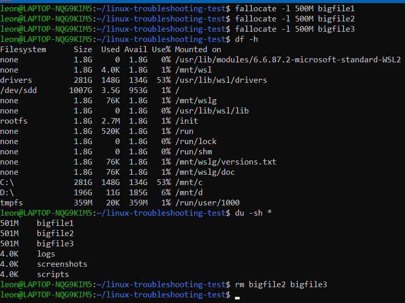

# Linux Troubleshooting Lab (WSL)

## Objective
Simulate common Linux server issues and perform troubleshooting.

## Tools
- WSL (Windows Subsystem for Linux)

## Case 1: Disk Full
### Problem
Disk usage increased due to large files.

### Commands Used
- df -h
- du -sh *

### Solution
Removed unnecessary large files using:
rm bigfile2 bigfile3

---

## Case 2: High CPU Usage

### Problem
A process consumed high CPU resources.

### Commands Used
- top
- kill -9

### Solution
Killed the process using:
kill -9 [PID]

---

## Case 3: Permission Denied

### Problem
File could not be accessed due to restricted permissions.

### Commands Used
- chmod

### Solution
Changed permission:
chmod 644 secret.txt

---

## Case 4: Log Monitoring

### Problem
Application error found in logs.

### Commands Used
- tail -f
- grep

### Solution
Identified error from log file.
